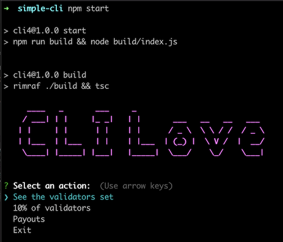

## Simple CLI tool

### Description of repo & Goals
Simple cli tool in order to try out some of the following :
- Get acquainted with the `ts` / `js` syntax, the different settings in `package.json` / `tsconfig.json` and dependencies.
- How to implement `async` / `await` / `Promises` concepts in `ts` / `js`.
- Use the `axios` client to try out some `get` commands.
- Check what information related to validators can be retrieved from the public sidecar 
https://polkadot-public-sidecar.parity-chains.parity.io/ 

### How to Run
- git clone the repo 
- have node js and typescript installed
- run the following command to install all dependencies :
    - `npm install nodemon ts-node inquirer rimraf figlet axios`
- run command `npm start`

### Screenshot from `npm start` command

